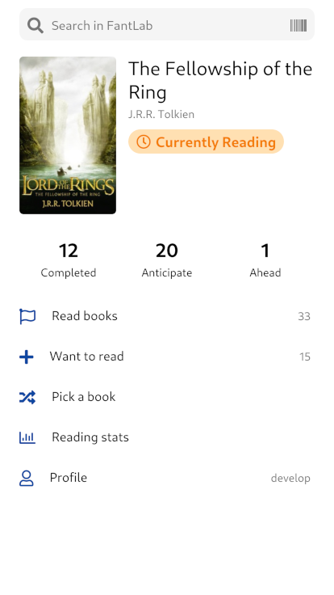
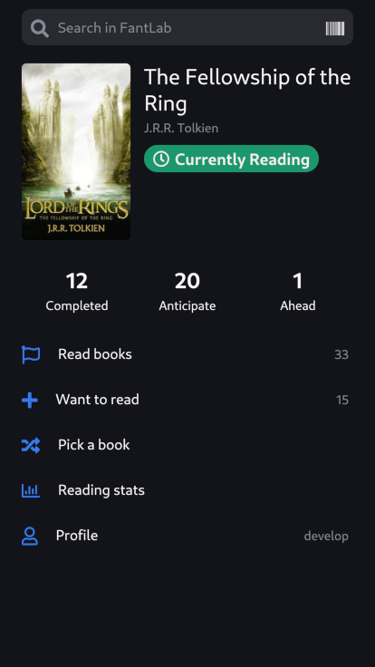

# Bookly

Bookly is a book manager where you can:

- to store the list of your read books
- to keep the list of books that you wish to read
- to pick a book from your wish list using filters and random
- to view reading stats
- to explore book data and book series
- to track the progress of the reading challenge

The app is available in English and Russian languages.

## [Other screens](./dev-tools/docs/screens.md)
