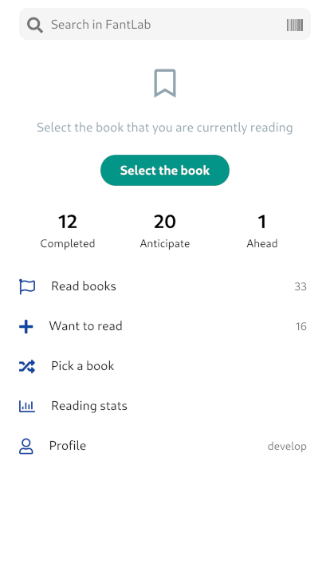
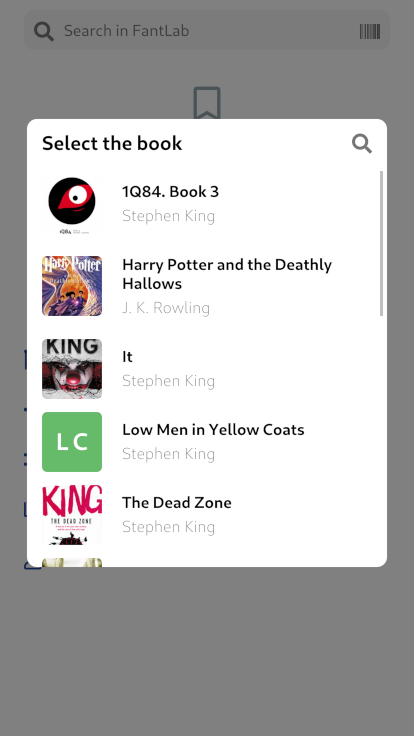
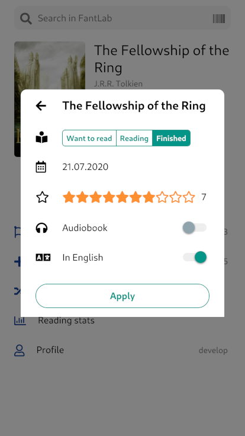
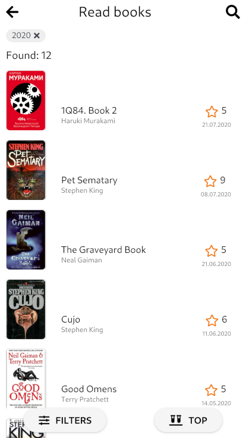
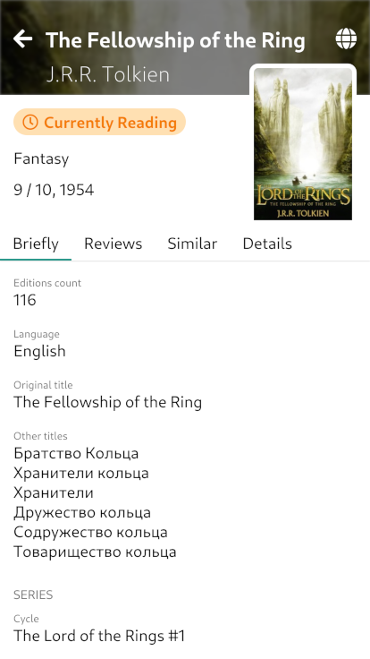
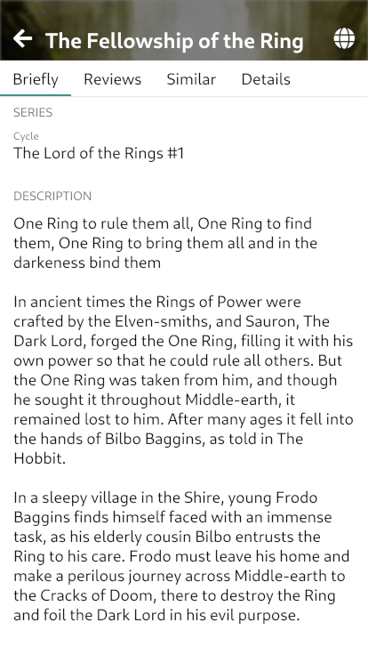
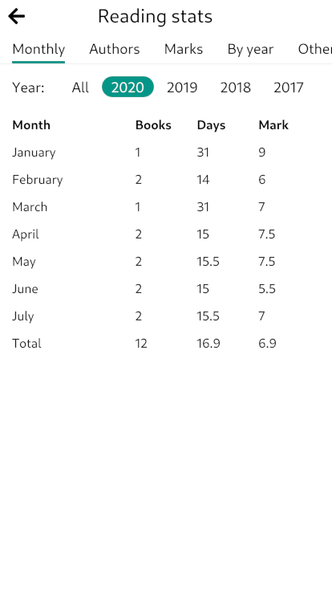

# Table of contents

- [Home screen](#home-screen)
- [Book list screen](#book-list-screen)
- [Book screen](#book-screen)
- [Stats screen](#stats-screen)

## Home screen

At home screen you can select the book you are currently reading:

Then the screen will be updated:

Afterward, you can mark it as read:

## Book list screen

Shows all your books added to wish or read list:

## Book screen

Shows detail information about the book:

## Stats screen

Shows your reading statistics. You can track stats by month, by author, by marks, and by year.

